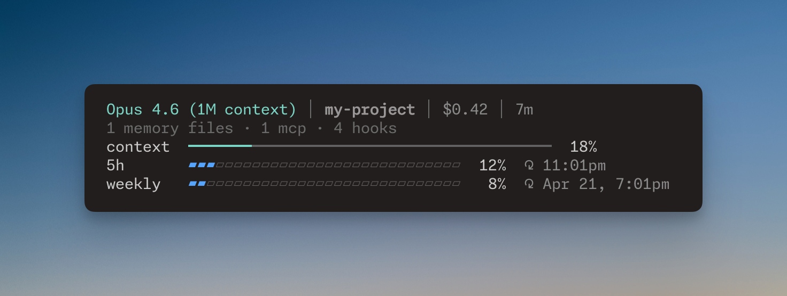
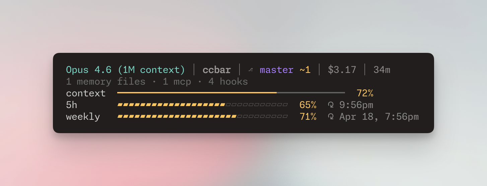
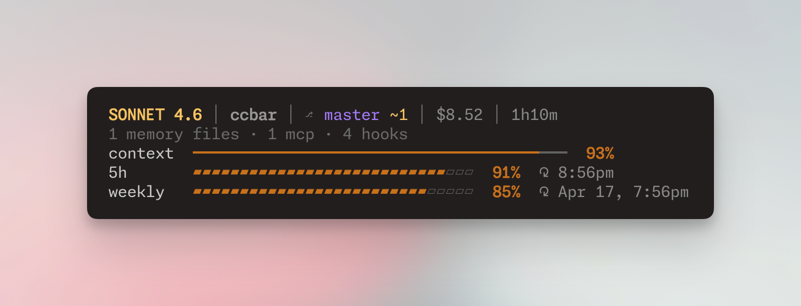

# ccbar

**[English](README.md) | [中文](README_CN.md)**

A beautifully designed status line for [Claude Code](https://docs.anthropic.com/en/docs/claude-code).

Single binary, zero dependencies, ~60ms startup. Built with Go.

### Normal — everything healthy



### Warning — resources getting warm



### Critical — time to /save



## What it shows

**Line 1** — Model, project, git branch with staged/modified counts, session cost, duration

**Line 2** — Config stats: CLAUDE.md files loaded, MCP servers, hooks

**Line 3** — Context window usage bar (cyan → yellow at 60% → red at 80%)

**Line 4–5** — Rate limits with progress bars and reset times (blue → yellow at 60% → red at 80%)

## Features

- **Instant rate limits** — OAuth fallback fetches rate limit data from macOS Keychain + Anthropic API, so you see 5h/7d usage immediately without waiting for the first interaction
- **Smart caching** — Git info cached 5s, config stats cached per session, OAuth cached 60s with stale-while-revalidate
- **Color-coded alerts** — Bars shift from calm (cyan/blue) → warning (yellow) → critical (red) as resources deplete
- **Zero dependencies** — Single Go binary, no runtime needed
- **Light & dark themes** — Optimized color palettes for both terminal backgrounds
- **Locale-aware dates** — Automatically uses 24h format and `4/18` style dates for Chinese locales, 12h AM/PM and `Apr 18` for others
- **Customizable layout** — Hide any section with `--hide config,5h,weekly`

## Install

### Homebrew (macOS/Linux)

```bash
brew tap oaooao/tap
brew install ccbar
```

### Go

```bash
go install github.com/oaooao/ccbar@latest
```

### Manual

Download the binary for your platform from [Releases](https://github.com/oaooao/ccbar/releases), extract it, and move it to a directory in your `$PATH`.

## Configure

### Quick setup

Run the interactive setup to automatically configure Claude Code:

```bash
ccbar setup
```

This reads your existing `~/.claude/settings.json`, shows you exactly what will change, and asks for confirmation before writing.

### Manual setup

Or add this to your Claude Code settings (`~/.claude/settings.json`) manually:

```json
{
  "statusLine": {
    "type": "command",
    "command": "ccbar",
    "refreshInterval": 3
  }
}
```

Restart Claude Code. The status line appears at the bottom after your first interaction.

### Light theme

If you use a light terminal background, add `--theme light`:

```json
{
  "statusLine": {
    "type": "command",
    "command": "ccbar --theme light",
    "refreshInterval": 3
  }
}
```

### Locale

Date and time format is auto-detected from your system `LANG` environment variable. To override:

```json
{
  "statusLine": {
    "type": "command",
    "command": "ccbar --locale zh",
    "refreshInterval": 3
  }
}
```

| Flag | Time format | Date format |
|------|------------|-------------|
| `--locale en` | `3:00pm` | `Apr 18, 3:00pm` |
| `--locale zh` | `15:00` | `4/18 15:00` |
| *(default)* | auto-detect from system | |

### Hide sections

Hide any section you don't need:

```json
{
  "statusLine": {
    "type": "command",
    "command": "ccbar --hide 5h,weekly",
    "refreshInterval": 3
  }
}
```

Available sections: `config`, `context`, `5h`, `weekly`

All flags can be combined: `ccbar --theme light --locale zh --hide config`

## Update

```bash
# Homebrew
brew upgrade ccbar

# Go
go install github.com/oaooao/ccbar@latest
```

## How it works

Claude Code pipes JSON session data to the status line command via stdin on every update. ccbar reads it, gathers supplementary data (git info, config stats, rate limits via OAuth if needed), and prints 5 ANSI-colored lines to stdout.

Rate limits require a Claude.ai Pro/Max subscription. ccbar retrieves your OAuth token from the macOS Keychain (or `~/.claude/.credentials.json`) to fetch rate limit data before the first API response.

## License

MIT
